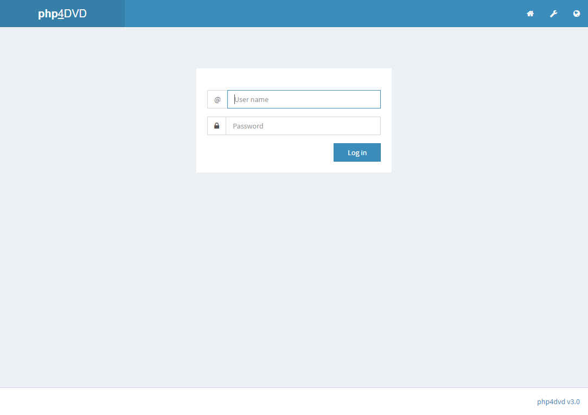
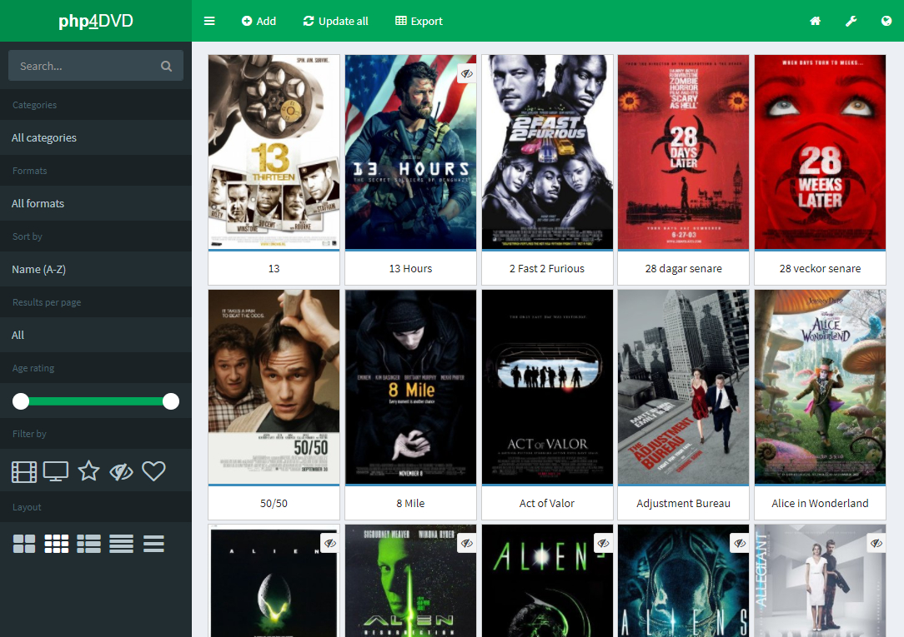
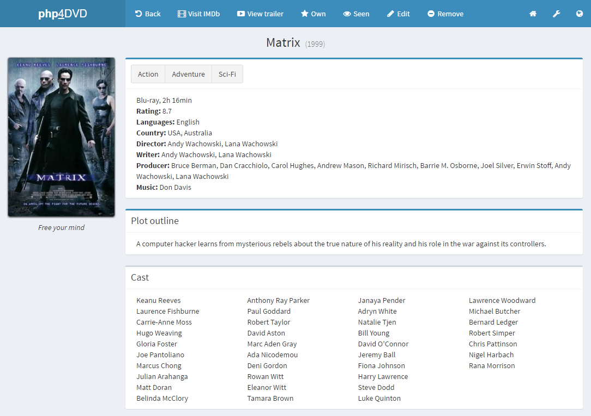
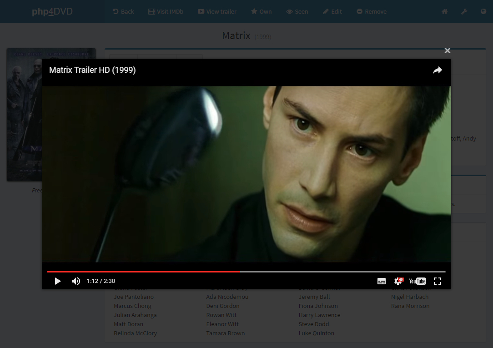
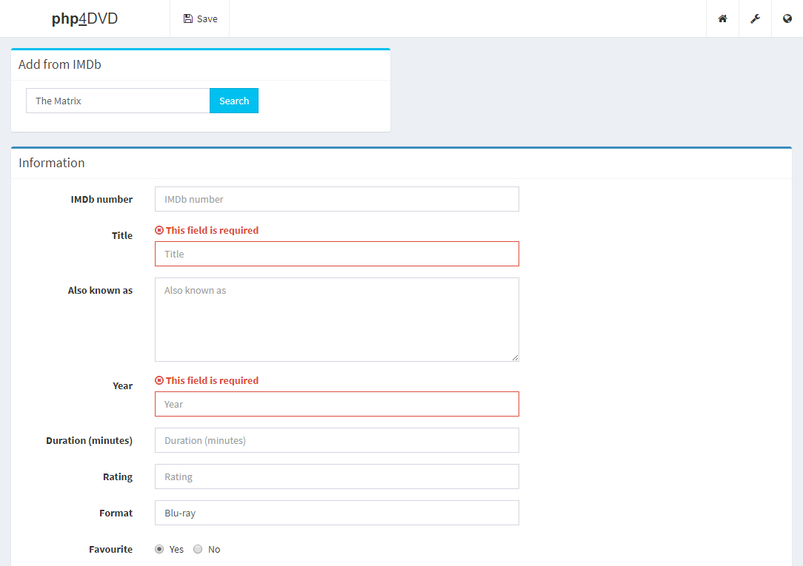
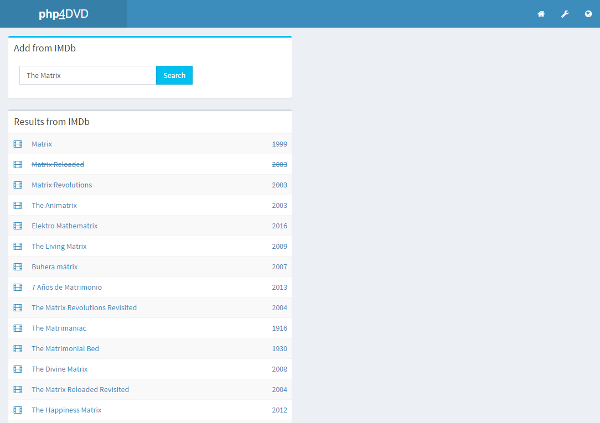
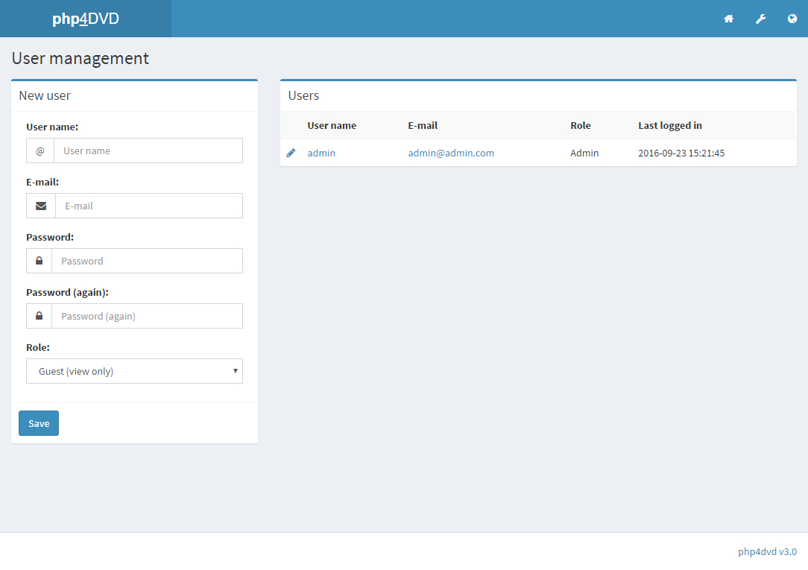

php4dvd 3.X
=======

php4dvd is a small yet powerful, php/mysql powered movie database.

Features
=======

- Add movie information from IMDb.com
  - (directors, actors, poster, language...)
- Keeps track on what movies you watched, bought or loaned out to a friend
- Add covers/posters to your movies
- What do you think about a movie? Write it down in personal notes
- Search function (title, year, plot)
  - Filter by: categories
  - Sort it by: name, year, rating, format, seen, own, added, loaned out
  - Results: limit amount of movies shown
  - Layouts: choose between five different display layouts
- Multi-user (admin, editor, guest)
- Multiple languages
- Very configurable, easy to use
- Editable templates using Smarty (no PHP knowledge is required)
- SEO Friendly URL
- Automatic YouTube trailers

Requirements
=======

- Apache 2+
- PHP 5.3.7+
- GD2 library to be able to upload (and resize) covers
- PDO library
  - PDO driver for MySQL/MariaDB
- cURL
- YouTube Data API key

Installation
=======
1. [Download](https://github.com/jreklund/php4dvd/archive/master.zip) and unzip php4dvd package if you haven't already.
2. Create a database for php4dvd on your web server, as well as a MySQL (or MariaDB) user who has all privileges for accessing and modifying it.
3. Upload the php4dvd files to the desired location on your web server:
   - (e.g. http://www.yoursite.com/php4dvd).
4. Run the php4dvd installation script by accessing the URL in a web browser. 
5. Manually remove the install/ directory.
6. Log into php4dvd using the username: admin, password: admin.
	
Upgrade
=======
Delete all files and folders except:
```
config/config.php
config/version.inc.php
movies/*
movies/covers/*
```
2. [Download](https://github.com/jreklund/php4dvd/archive/master.zip) and unzip php4dvd package if you haven't already.
3. Upload the php4dvd files to the desired location on your web server:
   - (e.g. http://www.yoursite.com/php4dvd).
4. Run the php4dvd installation script by accessing the URL in a web browser.
5. Manually remove the install/ directory.
6. Log into php4dvd using your username/password.

Screenshots
=======


 
 
 
 




Configuration / FAQ
=======

You will find all configurable options inside config/config.default.php,
all of which can be set in your config/config.php file. 
By default, guest users can't view your movie collection. If you want guest
users to view your collection, set the 'guestview' variable to true in
config/config.php after installation or upgrade.

###SEO Friendly URL (pretty_url)

Activate inside config/config.default.php or config/config.php and read
the instructions inside .htaccess.

###Internal Server Error

Try to run the website, but if the site failes opening with a 'Internal 
Server Error', adjust the .htaccess file in the root of the site.
Try to remove the Options line by placing a # at the beginning of the line.
Otherwise remove the `<Files>` section. These settings might fail because of
the permissions of your webserver.
    
Templates
=======

You can customize your site by adding your own template. Take a look at the
tpl/default/ directory and copy this directory to your own tpl directory.
Now you can adjust the config/config.php to your new template. Check all 
template files and try to adjust them to your own whishes.

If you just want to change the color, please check config/config.defaults.php for available skins.
    
Thanks to
=======

Thanks to cyberolf. He originally created [php4dvd](https://sourceforge.net/projects/php4dvd/).

Thanks to morphias0. He wrote the first automatic installer/upgrade script 
and came up with some extra features.
 
Thanks to Izzy from [IzzySoft](http://projects.izzysoft.de/trac/imdbphp). He wrote the imdbphp class to be able to 
search for movies at IMDb.com. Big shoutout to [Tom](https://github.com/tboothman/imdbphp) for continuing his work.

License
=======

This file is part of php4dvd.

php4dvd is free software: you can redistribute it and/or modify
it under the terms of the GNU General Public License as published by
the Free Software Foundation, either version 3 of the License, or
(at your option) any later version.

php4dvd is distributed in the hope that it will be useful,
but WITHOUT ANY WARRANTY; without even the implied warranty of
MERCHANTABILITY or FITNESS FOR A PARTICULAR PURPOSE.  See the
GNU General Public License for more details.

You should have received a copy of the GNU General Public License
along with php4dvd. If not, see <http://www.gnu.org/licenses/>.
